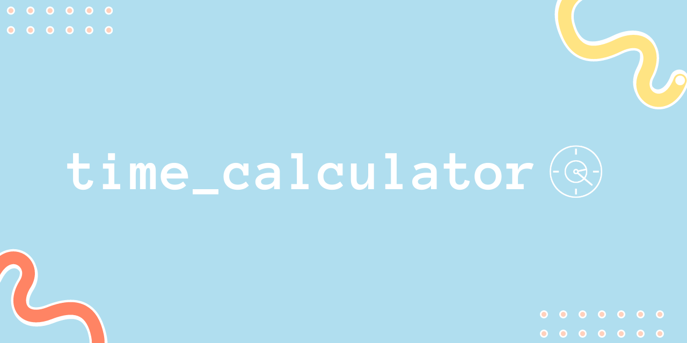

### About this project

This project is from freeCodeCamp's Scientific Computing with Python Certificate. This repository contains the prompt for the project as well as my solution for the assignment. 

To run my time_calculator code with the tests provided by freeCodeCamp for this project, feel free to visit [my replit](https://replit.com/@NataliaRosado1/time-calculator).


### Assignment

Write a function named `add_time` that takes in two required parameters and one optional parameter:
* a start time in the 12-hour clock format (ending in AM or PM) 
* a duration time that indicates the number of hours and minutes
* (optional) a starting day of the week, case insensitive

The function should add the duration time to the start time and return the result.

If the result will be the next day, it should show `(next day)` after the time. If the result will be more than one day later, it should show `(n days later)` after the time, where "n" is the number of days later.

If the function is given the optional starting day of the week parameter, then the output should display the day of the week of the result. The day of the week in the output should appear after the time and before the number of days later.

Below are some examples of different cases the function should handle. Pay close attention to the spacing and punctuation of the results.
```py
add_time("3:00 PM", "3:10")
# Returns: 6:10 PM

add_time("11:30 AM", "2:32", "Monday")
# Returns: 2:02 PM, Monday

add_time("11:43 AM", "00:20")
# Returns: 12:03 PM

add_time("10:10 PM", "3:30")
# Returns: 1:40 AM (next day)

add_time("11:43 PM", "24:20", "tueSday")
# Returns: 12:03 AM, Thursday (2 days later)

add_time("6:30 PM", "205:12")
# Returns: 7:42 AM (9 days later)
```

Do not import any Python libraries. Assume that the start times are valid times. The minutes in the duration time will be a whole number less than 60, but the hour can be any whole number.


### My Solution

```
def add_time(start, duration, day=''):
  
  start_0 = start.split()[0]
  (start_hr, start_min) = start_0.split(':')
  (start_hr, start_min) = (int(start_hr), int(start_min))

  start_1 = start.split()[1]
  if start_1 == 'PM':
    start_hr = start_hr + 12

  (duration_hr, duration_min) = duration.split(':')
  (duration_hr, duration_min) = (int(duration_hr), int(duration_min))

  (new_hr, new_min) = (start_hr + duration_hr, start_min + duration_min)

  if new_min > 59:
    new_hr += 1
    new_min %= 60 
    
  week = ['monday', 'tuesday', 'wednesday', 'thursday', 'friday', 'saturday', 'sunday']
  if day != '':
    day_index = week.index(day.casefold())  
    
  new_2 = ''
  new_3 = ''

  if new_hr >= 24:
    n = int(new_hr/24)
    new_hr %= 24
    
    if day != '':
      day_index += n
      
    if n == 1:
      new_3 = '(next day)'
    else:
      new_3 = '({} days later)'.format(n)
  
  if day != '':    
    day_index %= 7
    new_2 = week[day_index].capitalize()    
        
  if new_hr > 12:
    new_hr %= 12
    new_1 = 'PM'
  elif new_hr == 12:
    new_1 = 'PM'
  else:
    new_1 = 'AM'

  if new_hr == 0:
      new_hr += 12

  new_hr = str(new_hr)
  
  if new_min < 10:
    new_min = str(new_min)
    new_min = '0' + new_min
  else:
    new_min = str(new_min)

  new_time = ':'.join((new_hr, new_min))
  new_time = ' '.join((new_time, new_1))
  
  if new_2 != '':
    new_time = ', '.join((new_time, new_2))

  if new_3 != '':    
    new_time = ' '.join((new_time, new_3))

  return new_time
```

